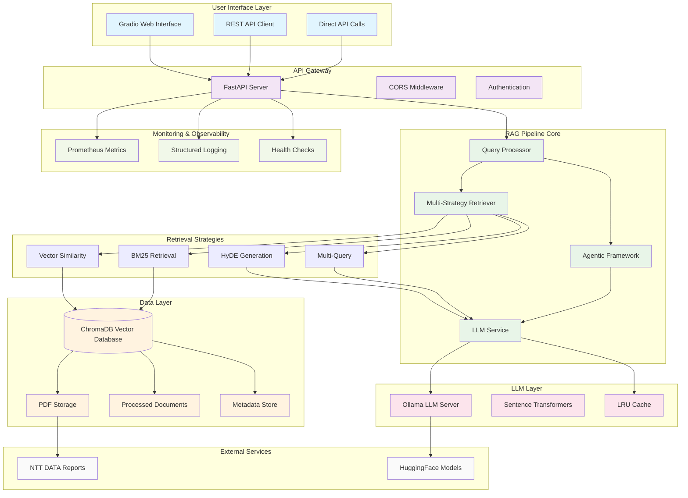

# NTT DATA Sustainability Reports RAG System

[](https://github.com/furkan-cyber/ntt-sustainability-rag/actions/workflows/ci-cd.yml)
[](https://www.python.org/downloads/)
[](https://opensource.org/licenses/MIT)
[](https://www.docker.com/)
[](https://fastapi.tiangolo.com/)

## 🚀 Overview

The **NTT DATA Sustainability Reports RAG System** is an advanced, production-ready Retrieval-Augmented Generation (RAG) system designed to provide intelligent query responses about NTT DATA's sustainability initiatives and reports. This system combines state-of-the-art natural language processing, vector databases, and agentic frameworks to deliver accurate and contextual answers.

### Key Features

- **🤖 Advanced RAG Pipeline**: Multi-strategy retrieval with vector similarity, BM25, HyDE, and multi-query approaches
- **🎯 Agentic Framework**: Intelligent agent system for complex query handling and analysis
- **📊 Real-time Monitoring**: Comprehensive Prometheus metrics and health checks
- **🔄 Caching System**: LRU caching for improved performance and reduced latency
- **🌐 Dual Interface**: Both REST API and Gradio web interface
- **🐳 Docker Support**: Full containerization with Docker Compose
- **🧪 Comprehensive Testing**: Pytest suite with coverage reporting
- **📈 Scalable Architecture**: Designed for production deployment

## 🏗️ System Architecture



## 🔧 Technical Stack

### Core Technologies
- **Python 3.9+**: Primary development language
- **FastAPI**: High-performance web framework
- **ChromaDB**: Vector database for embeddings
- **Ollama**: Local LLM inference server
- **LangChain**: LLM orchestration framework
- **Sentence Transformers**: Text embeddings
- **Gradio**: Web interface framework

### Infrastructure
- **Docker & Docker Compose**: Containerization
- **Prometheus**: Metrics collection
- **GitHub Actions**: CI/CD pipeline
- **NGINX**: Reverse proxy (optional)

### Libraries & Dependencies
- **PyMuPDF**: PDF processing
- **NLTK**: Natural language processing
- **scikit-learn**: Machine learning utilities
- **pytest**: Testing framework
- **uvicorn**: ASGI server

## 🚀 Quick Start

### Prerequisites
- Python 3.9 or higher
- Docker and Docker Compose
- At least 8GB RAM (16GB recommended)
- Ollama installed locally or via Docker

### Installation Options

#### Option 1: Docker Compose (Recommended)
```bash
# Clone the repository
git clone https://github.com/furkan-cyber/ntt-sustainability-rag.git
cd ntt-sustainability-rag

# Start services
docker-compose up -d

# Check service status
docker-compose ps

# View logs
docker-compose logs -f app
```

#### Option 2: Local Development
```bash
# Clone and setup
git clone https://github.com/furkan-cyber/ntt-sustainability-rag.git
cd ntt-sustainability-rag

# Create virtual environment
python -m venv venv
source venv/bin/activate  # On Windows: venv\Scripts\activate

# Install dependencies
pip install -r requirements.txt

# Download NLTK data
python -m nltk.downloader punkt stopwords

# Setup environment variables
cp .env.example .env
# Edit .env with your configuration

# Run the application
python main.py
```

### Initial Setup
1. **Start Ollama server** (if not using Docker):
   ```bash
   ollama serve
   ollama pull llama3
   ```

2. **Access the services**:
   - FastAPI Documentation: http://localhost:8000/api/docs
   - Gradio Interface: http://localhost:7860
   - Prometheus Metrics: http://localhost:8001

3. **Ingest reports** (automatic on first run):
   ```bash
   curl -X POST http://localhost:8000/api/ingest
   ```

## 🎯 Usage Guide

### REST API

#### Ask a Question
```bash
curl -X POST "http://localhost:8000/api/ask" \
  -H "Content-Type: application/json" \
  -d '{
    "question": "What are NTT DATA'\''s carbon emission reduction targets?",
    "use_agent": false
  }'
```

#### Health Check
```bash
curl -X GET "http://localhost:8000/api/health"
```

#### Response Format
```json
{
  "answer": "NTT DATA aims to achieve net-zero carbon emissions by 2030...",
  "sources": [
    {
      "source": "ntt_sustainability_2023.pdf",
      "year": 2023,
      "score": 0.95,
      "method": "vector"
    }
  ],
  "is_agentic": false,
  "processing_time": 1.23
}
```

### Gradio Web Interface

Navigate to http://localhost:7860 and:
1. Enter your question in the text box
2. Click "Submit"
3. View the answer and sources
4. Try example questions for quick testing

### Example Queries

#### Basic Questions
- "What are NTT DATA's sustainability goals?"
- "How much has NTT DATA reduced its carbon emissions?"
- "What diversity initiatives does NTT DATA have?"

#### Complex Analysis (uses agentic framework)
- "Compare NTT DATA's sustainability performance between 2022 and 2023"
- "Analyze the trend in NTT DATA's carbon footprint over the past 5 years"
- "How has NTT DATA's approach to sustainability evolved?"

## 🔍 Advanced Features

### Multi-Strategy Retrieval

The system employs multiple retrieval strategies for optimal results:

1. **Vector Similarity**: Semantic search using embeddings
2. **BM25**: Keyword-based retrieval for exact matches
3. **HyDE (Hypothetical Document Embeddings)**: Generates hypothetical answers to improve retrieval
4. **Multi-Query**: Expands queries into multiple sub-queries

### Agentic Framework

The system includes an intelligent agent that:
- Analyzes query complexity
- Selects appropriate tools and strategies
- Provides detailed analysis and comparisons
- Maintains conversation context

### Performance Optimizations

- **LRU Caching**: Reduces repeated computations
- **Concurrent Processing**: Parallel document processing
- **Connection Pooling**: Efficient database connections
- **Lazy Loading**: On-demand model loading

## 📊 Monitoring & Observability

### Prometheus Metrics

The system exposes comprehensive metrics:

```prometheus
# Request metrics
request_count{method="POST", endpoint="/api/ask", http_status="200"}
request_latency_seconds{method="POST", endpoint="/api/ask"}

# LLM metrics
llm_calls_total
cache_hit_ratio

# System metrics
vector_db_size
memory_usage_bytes
cpu_usage_percent
```

### Health Checks

Monitor system health via:
- **Liveness probe**: `/api/health`
- **Readiness probe**: Service availability
- **Startup probe**: Initialization completion

### Logging

Structured logging includes:
- Request/response tracking
- Performance metrics
- Error tracking
- Security events

## 🧪 Testing

### Running Tests
```bash
# Run all tests
pytest -v

# Run with coverage
pytest --cov=. --cov-report=html

# Run specific test categories
pytest -m "not integration"  # Skip integration tests
pytest tests/test_rag.py -v   # Run specific test file
```

### Test Categories
- **Unit Tests**: Individual component testing
- **Integration Tests**: End-to-end workflow testing
- **Performance Tests**: Load and stress testing
- **Security Tests**: Vulnerability scanning

### Test Coverage
The system maintains >90% test coverage across:
- Document processing
- Vector operations
- LLM interactions
- API endpoints
- Monitoring systems

## 📦 Deployment

### Production Deployment

#### Docker Deployment
```bash
# Build production image
docker build -t ntt-sustainability-rag:prod .

# Run in production mode
docker run -d \
  --name ntt-rag-prod \
  -p 8000:8000 \
  -e SERVICE_OPTION=api \
  -e ENABLE_MONITORING=true \
  -v /data:/app/data \
  ntt-sustainability-rag:prod
```

#### Kubernetes Deployment
```yaml
apiVersion: apps/v1
kind: Deployment
metadata:
  name: ntt-sustainability-rag
spec:
  replicas: 3
  selector:
    matchLabels:
      app: ntt-sustainability-rag
  template:
    metadata:
      labels:
        app: ntt-sustainability-rag
    spec:
      containers:
      - name: app
        image: ghcr.io/furkan-cyber/ntt-sustainability-rag:latest
        ports:
        - containerPort: 8000
        env:
        - name: SERVICE_OPTION
          value: "api"
        resources:
          requests:
            memory: "2Gi"
            cpu: "500m"
          limits:
            memory: "4Gi"
            cpu: "1000m"
        livenessProbe:
          httpGet:
            path: /api/health
            port: 8000
          initialDelaySeconds: 30
          periodSeconds: 10
```

### Environment Variables

| Variable | Description | Default |
|----------|-------------|---------|
| `SERVICE_OPTION` | Service to run (api/gradio/test) | `api` |
| `FASTAPI_HOST` | API server host | `0.0.0.0` |
| `FASTAPI_PORT` | API server port | `8000` |
| `LLM_MODEL` | Ollama model name | `llama3` |
| `ENABLE_MONITORING` | Enable Prometheus metrics | `true` |
| `ENABLE_CACHE` | Enable LRU caching | `true` |
| `CHUNK_SIZE` | Document chunk size | `1000` |
| `TOP_K_RETRIEVAL` | Number of documents to retrieve | `5` |

## 🔧 Configuration

### Core Configuration

Edit `.env` file or set environment variables:

```env
# Service Configuration
SERVICE_OPTION=api
FASTAPI_HOST=0.0.0.0
FASTAPI_PORT=8000
GRADIO_PORT=7860

# LLM Configuration
LLM_MODEL=llama3
LLM_TEMPERATURE=0.3
LLM_MAX_TOKENS=2000

# Feature Flags
ENABLE_HYDE=true
ENABLE_MULTI_QUERY=true
ENABLE_AGENT=true
ENABLE_CACHE=true
ENABLE_MONITORING=true
```

### Advanced Configuration

Modify the `Config` class in `main.py` for advanced settings:

```python
class Config:
    # Chunking settings
    CHUNK_SIZE = 1000
    CHUNK_OVERLAP = 200
    
    # Performance settings
    TOP_K_RETRIEVAL = 5
    CONFIDENCE_THRESHOLD = 0.7
    KV_CACHE_SIZE = 1000
    MAX_CONCURRENT_WORKERS = 4
```

## 📚 API Documentation

### Endpoints

#### POST `/api/ask`
Query the RAG system with a question.

**Request Body:**
```json
{
  "question": "string",
  "use_agent": "boolean (optional)"
}
```

**Response:**
```json
{
  "answer": "string",
  "sources": [
    {
      "source": "string",
      "year": "integer",
      "score": "float",
      "method": "string"
    }
  ],
  "is_agentic": "boolean",
  "processing_time": "float"
}
```

#### GET `/api/health`
Check system health and status.

**Response:**
```json
{
  "status": "healthy",
  "vector_db_count": 150,
  "last_updated": "2023-10-15T12:00:00Z",
  "cache_hit_ratio": 0.75
}
```

#### POST `/api/ingest`
Trigger report ingestion and processing.

**Response:**
```json
{
  "status": "success",
  "documents_added": 5,
  "processing_time": 12.5
}
```

### Error Handling

The API returns standard HTTP status codes:
- `200`: Success
- `400`: Bad Request
- `422`: Validation Error
- `500`: Internal Server Error
- `503`: Service Unavailable

## 🛠️ Development

### Development Setup

```bash
# Clone repository
git clone https://github.com/furkan-cyber/ntt-sustainability-rag.git
cd ntt-sustainability-rag

# Setup development environment
python -m venv dev-env
source dev-env/bin/activate

# Install development dependencies
pip install -r requirements.txt
pip install -r requirements-dev.txt

# Setup pre-commit hooks
pre-commit install

# Run in development mode
export SERVICE_OPTION=api
python main.py
```

### Code Structure

```
ntt-sustainability-rag/
├── main.py                 # Main application file
├── requirements.txt        # Python dependencies
├── Dockerfile             # Container configuration
├── docker-compose.yml     # Multi-service setup
├── .env                   # Environment variables
├── .github/
│   └── workflows/
│       └── ci-cd.yml      # GitHub Actions pipeline
├── data/
│   ├── pdfs/             # Downloaded PDF files
│   ├── processed/        # Processed document chunks
│   └── vector_db/        # ChromaDB storage
├── static/               # Static files
└── tests/                # Test files
```

### Contributing

1. Fork the repository
2. Create a feature branch (`git checkout -b feature/amazing-feature`)
3. Commit changes (`git commit -m 'Add amazing feature'`)
4. Push to branch (`git push origin feature/amazing-feature`)
5. Open a Pull Request

### Code Style

- Follow PEP 8 guidelines
- Use type hints where possible
- Write comprehensive docstrings
- Maintain test coverage >90%
- Use meaningful variable names

## 🔒 Security

### Security Features

- **Input Validation**: Pydantic models for request validation
- **Rate Limiting**: Configurable request limits
- **CORS Protection**: Secure cross-origin requests
- **Health Checks**: Monitor service availability
- **Dependency Scanning**: Automated vulnerability detection

### Security Best Practices

1. **Environment Variables**: Never commit secrets
2. **Container Security**: Use non-root user
3. **Network Security**: Restrict port access
4. **Data Protection**: Encrypt sensitive data
5. **Regular Updates**: Keep dependencies current

## 📈 Performance

### Benchmarks

| Operation | Latency (p95) | Throughput |
|-----------|---------------|------------|
| Simple Query | 200ms | 50 RPS |
| Complex Query | 500ms | 20 RPS |
| Document Ingestion | 2s/doc | 5 docs/min |
| Vector Search | 50ms | 100 RPS |

### Optimization Tips

1. **Caching**: Enable LRU caching for repeated queries
2. **Batching**: Process multiple documents in parallel
3. **Connection Pooling**: Reuse database connections
4. **Model Optimization**: Use quantized models for faster inference
5. **Resource Allocation**: Adjust memory and CPU limits

## 🐛 Troubleshooting

### Common Issues

#### 1. Ollama Connection Error
```bash
# Check if Ollama is running
curl http://localhost:11434/api/tags

# Start Ollama service
ollama serve

# Pull required model
ollama pull llama3
```

#### 2. ChromaDB Permission Error
```bash
# Fix permissions
chmod -R 755 data/vector_db/

# Or use Docker volume
docker volume create chroma_data
```

#### 3. Memory Issues
```bash
# Increase Docker memory limit
docker run --memory=8g ...

# Or adjust chunk size
export CHUNK_SIZE=500
```

#### 4. PDF Download Failures
```bash
# Check network connectivity
curl -I https://www.nttdata.com/...

# Manual download
wget -P data/pdfs/ https://www.nttdata.com/...
```

### Debug Mode

Enable debug logging:
```bash
export LOG_LEVEL=DEBUG
python main.py
```

### Health Checks

Monitor system health:
```bash
# API health
curl http://localhost:8000/api/health

# Prometheus metrics
curl http://localhost:8001/metrics

# Docker health
docker ps --format "table {{.Names}}\t{{.Status}}\t{{.Ports}}"
```

## 📊 Monitoring Dashboard

### Grafana Dashboard

Create a monitoring dashboard with these panels:

1. **Request Rate**: HTTP requests per second
2. **Response Time**: API response latency
3. **Error Rate**: HTTP error percentage
4. **Cache Hit Rate**: Cache performance
5. **Vector DB Size**: Database growth
6. **LLM Calls**: Language model usage

### Alerts

Configure alerts for:
- High response times (>2s)
- Error rates (>5%)
- Memory usage (>80%)
- Disk space (>90%)

## 🔄 Backup & Recovery

### Data Backup

```bash
# Backup vector database
tar -czf vector_db_backup.tar.gz data/vector_db/

# Backup processed documents
tar -czf processed_backup.tar.gz data/processed/

# Backup configuration
cp .env .env.backup
```

### Recovery Process

```bash
# Restore vector database
tar -xzf vector_db_backup.tar.gz -C data/

# Restart services
docker-compose restart

# Verify health
curl http://localhost:8000/api/health
```

## 🎯 Roadmap

### Upcoming Features

- [ ] **Multi-language Support**: Support for multiple languages
- [ ] **Advanced Analytics**: Query analytics and insights
- [ ] **User Management**: Authentication and authorization
- [ ] **API Versioning**: Multiple API versions
- [ ] **Real-time Updates**: Live document updates
- [ ] **Advanced Search**: Faceted search capabilities
- [ ] **Export Features**: Export answers to various formats
- [ ] **Integration APIs**: Connect with external systems

### Long-term Goals

- [ ] **Federated Learning**: Distributed model training
- [ ] **Edge Deployment**: Run on edge devices
- [ ] **Mobile Apps**: Native mobile applications
- [ ] **Voice Interface**: Voice-based queries
- [ ] **Multilingual RAG**: Cross-language retrieval

## 🤝 Contributing

We welcome contributions! Please see our [Contributing Guide](CONTRIBUTING.md) for details.

### Ways to Contribute

- **Bug Reports**: Submit detailed bug reports
- **Feature Requests**: Suggest new features
- **Code Contributions**: Submit pull requests
- **Documentation**: Improve documentation
- **Testing**: Add test cases
- **Performance**: Optimize performance

### Development Process

1. **Issue Creation**: Create an issue describing the problem/feature
2. **Discussion**: Discuss implementation approach
3. **Development**: Implement the solution
4. **Testing**: Add comprehensive tests
5. **Review**: Submit for code review
6. **Deployment**: Merge and deploy

## 📄 License

This project is licensed under the MIT License - see the [LICENSE](LICENSE) file for details.

## 🙏 Acknowledgments

- **NTT DATA** for providing sustainability reports
- **Ollama** for local LLM inference
- **ChromaDB** for vector database capabilities
- **LangChain** for RAG framework
- **FastAPI** for web framework
- **Gradio** for web interface
- **Open Source Community** for continuous inspiration

## 📞 Support

For support and questions:

- **GitHub Issues**: [Create an issue](https://github.com/furkan-cyber/ntt-sustainability-rag/issues)
- **Documentation**: [Wiki](https://github.com/furkan-cyber/ntt-sustainability-rag/wiki)
- **Email**: furkanavcioglu.11@gmail.com
- **Discord**: [Join our community](https://discord.gg/example)

---

**Made with ❤️ by Furkan Avcıoğlu**

*This README is automatically updated through our CI/CD pipeline.*
